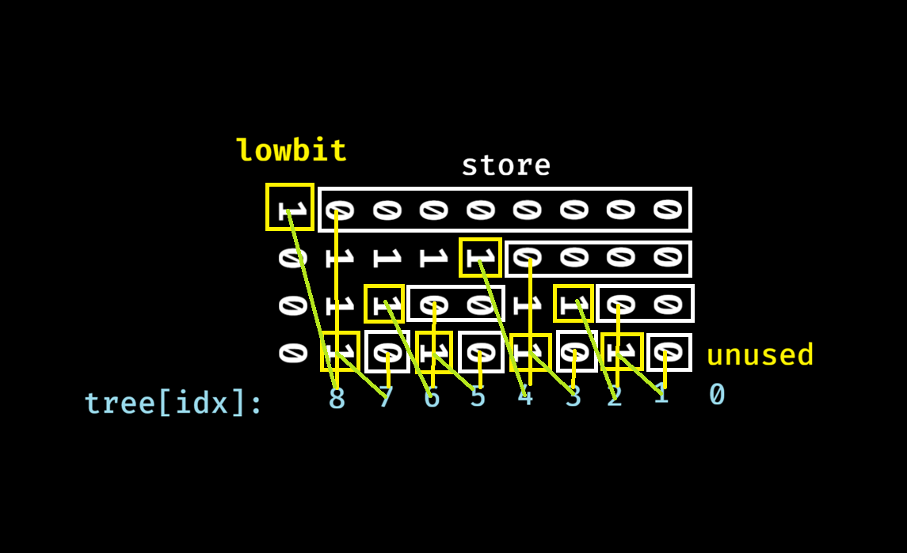

# 关于树状数组

树状数组就是最简单的动态`RMQ`问题数据结构（bushi

几十行代码解决

## 原理

首先我们发现，一颗二叉树如果每层都存数据效率并不高，很多地方的数据有重叠

而树状数组则把重叠的数据（在这种情况下，右子节点）的数据存储在父节点内

通过`lowbit(x)`获取二进制下最低一位来访问

可能不太好理解，这里放一张图



可以发现，每个区间的前缀和都可以通过二进制拼出来

比如`tree[7]=7+6+4`，也就是从`7`开始一直减去它的`lowbit`直到`0`并求和

访问就完成了

那么如何修改呢

可以看到，修改一个节点只会影响它和它的父节点

也就是从`idx`开始一直加上`lowbit`直到`maxsize`并修改

就这样了

## Code

代码使用了模板，可以塞任何东西进去

~~理论上`fenwickTree<fenwickTree<int>>`也行~~

```cpp
#include <iostream>
#include <vector>
using namespace std;
int lowbit(int x){
    return x&-x;
}
template<typename T>
struct fenwickTree{
    vector<T> tree;
    int size;
    void add(int index,int delta){
        index++;
        while(index<=size){
            tree[index]+=delta;
            index+=lowbit(index);
        }
    }
    T sum(int index){
        index++;
        T res=T();
        while(index>0){
            res+=tree[index];
            index-=lowbit(index);
        }
        return res;
    }
    T query(int l,int r){
        return sum(r)-sum(l-1);
    }
    fenwickTree(int size,const vector<T>& target):size(size){
        tree.resize(size+1);
        for(int i=0;i<size;i++){
            add(i,target.at(i));
        }
    }
};
int main(){
    int n,m;
    cin>>n>>m;
    vector<int> nums;
    for(int i=0;i<n;i++){
        int tmp;
        cin>>tmp;
        nums.push_back(tmp);
    }
    fenwickTree<int> ft(n,nums);
    for(int i=0;i<m;i++){
        int op,x,y;
        cin>>op>>x>>y;
        x--;
        if(op==1){
            ft.add(x,y);
        }
        else{
            y--;
            cout<<ft.query(x,y)<<endl;
        }
    }
}
```
